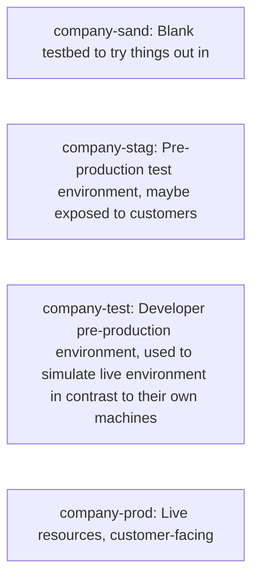

# Securing CDK CloudFormation

CDK has a pretty big security issue. By default, it runs _everything_ with
the AdministratorAccess role. Unfortunately, it's not really possible to
permission-scope these roles, because they're account-wide when the bootstrap
runs.

Upon consulting an AWS account manager, it became clear that the security
control CDK expects you to implement is _account-level_ isolation between
projects/deployments.

In some AWS environments, you might expect an account layout like this:

So let's use this in our example.

Let's say the staging, testing, and production accounts hold _the same
applications_, just at different stages in the deployment/testing/release cycle.

We'll use three applications as examples:

- Commerce: The company's primary revenue stream, an ecommerce platform.
- Audial: A streaming service for music bought off Commerce.
- Playback: A streaming service for videos bought off Commerce.

In this example, the staging, testing, and production accounts hold one or more
environments of Commerce, Audial and Playback, with slightly differing
configurations. (i.e. different database credentials, different public URLs, etc.)

---

# TODO
